<div align="center">

<!-- ANIMATED HEADER SVG -->


</div>

---

<div align="center">

<!-- LIVE TYPING SVG -->
[](https://git.io/typing-svg)

</div>

---

```
┌─────────────────────────────────────────────────────────────────────┐
│                                                                     │
│   ALIAS    ::  siriron                    CHAIN  ::  EVM + Solana  │
│   TWITTER  ::  @Sir_Ironheart            STACK  ::  Sol · TS · Rust│
│   SECTOR   ::  Web3 / DeFi / L2          NODE   ::  ONLINE [████]  │
│                                                                     │
└─────────────────────────────────────────────────────────────────────┘
```

---

## `> TECH ARSENAL`

<div align="center">

**[ BLOCKCHAIN ]**


**[ FRONTEND / INTEGRATION ]**


**[ INFRA / TOOLS ]**


</div>

---

## `> AREAS OF OPERATION`

```
  [✓]  Smart Contract Development  ·············  Solidity / EVM / ERC Standards
  [✓]  DeFi Protocol Architecture  ·············  AMMs, Vaults, Yield, Lending
  [✓]  NFT Infrastructure          ·············  ERC-721 / ERC-1155 / Metadata
  [✓]  On-chain Security & Auditing ············  Reentrancy, MEV, Slippage
  [✓]  On-chain & L2 Deployments ············  Arbitrum, OP, zkSync, Base
  [✓]  Web3 Frontend Integration   ·············  wagmi / viem / ethers.js
  [✓]  Solana Programs             ·············  Anchor Framework / PDAs
  [ ]  Sleep                       ·············  not yet implemented
```

---

## `> CONTRIBUTION BLOCKCHAIN`

<div align="center">



</div>

---

## `> GITHUB METRICS`
<div align="center">


</div>

---

## `> CURRENT MISSION`

```
  >> Deploying next-gen DeFi contracts to mainnet
  >> Researching ZK proofs & validity rollup architecture
  >> Building open-source tooling for Web3 devs
  >> Connecting the dots between code and capital
  >> Making blockchains feel like magic for end users
```

---

## `> FIND ME`

<div align="center">

[](https://twitter.com/Sir_Ironheart)
[](https://github.com/Siriron)

</div>

---

<div align="center">

```
  ~~~~~~~~~~~~~~~~~~~~~~~~~~~~~~~~~~~~~~~~~~~~~~~~~~~~~~~~~~~~~~~~~~
  |  SIRIRON v1.0  ·  On-chain. Unstoppable. Permissionless.      |
  |  Any chain. Any contract. Your rules. No middlemen.           |
  ~~~~~~~~~~~~~~~~~~~~~~~~~~~~~~~~~~~~~~~~~~~~~~~~~~~~~~~~~~~~~~~~~~
```


</div>
